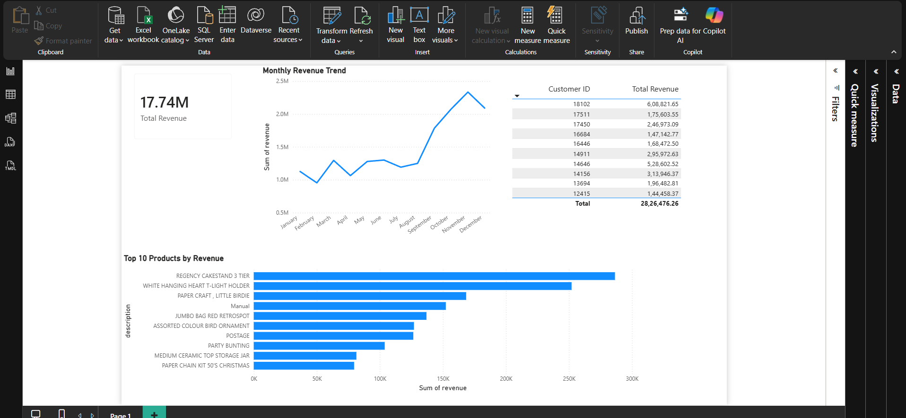

# Business Sales Analytics Project

## Project Overview
This project is an end-to-end sales data analytics solution built using real transactional data.  
The objective is to clean raw business data, perform SQL-based analysis, and generate insights that help understand sales performance and customer behavior.

The project follows a real-world analytics workflow used in industry.

---

## Business Problem
A retail business wants to:
- Understand overall and monthly sales performance  
- Identify top-selling products  
- Analyze repeat customers  
- Prepare clean data for dashboard reporting  

The raw data contains missing values, invalid records, and inconsistent formatting, making it unsuitable for direct analysis.

---

## Tools & Technologies Used
- **Python (Pandas)** – Data cleaning and preprocessing  
- **SQL (SQLite)** – Business analysis queries  
- **Power BI** – Dashboard and visualization  
- **VS Code** – Development environment  
- **GitHub** – Version control and project sharing  

---

## Project Structure
business-sales-analytics/
- data/
  - raw/                    # Original raw dataset (unchanged)
  - processed/              # Cleaned working dataset
  - final/                  # Dashboard-ready dataset
- python/
  - 00_data_understanding.py
  - 01_data_cleaning.py
  - 02_load_to_sql.py
  - 03_export_final_data.py
- sql/
  - 01_sales_analysis.sql
- dashboard/
  - sales_dashboard.pbix
- README.md

---

## Project Workflow

### Data Understanding
- Inspected dataset structure and column names  
- Identified missing values and invalid records  
- Verified data types and formats  

---

### Data Cleaning (Python)
- Removed cancelled invoices  
- Removed rows with missing customer IDs  
- Removed invalid quantities and prices  
- Standardized column names  
- Created a revenue column  

Cleaned data saved to:
data/processed/cleaned_online_retail.csv

---

### SQL Analysis

The cleaned data was loaded into an SQLite database and analyzed using SQL.

Key analyses include:
- Total revenue calculation  
- Monthly sales trend  
- Top-selling products  
- Repeat customer analysis  

---

### Dashboard (Power BI)

A Power BI dashboard was created with:
- Total Revenue KPI  
- Monthly Sales Trend  
- Top Products  
- Top Customers  

Dashboard file:

---

## Key Insights
- A small number of products contribute to the majority of revenue  
- Repeat customers significantly impact overall sales  
- Clear monthly sales trends are visible  

---

## Dataset
- Online Retail transactional dataset  
- File format: CSV  
- Contains invoice-level sales transactions  
